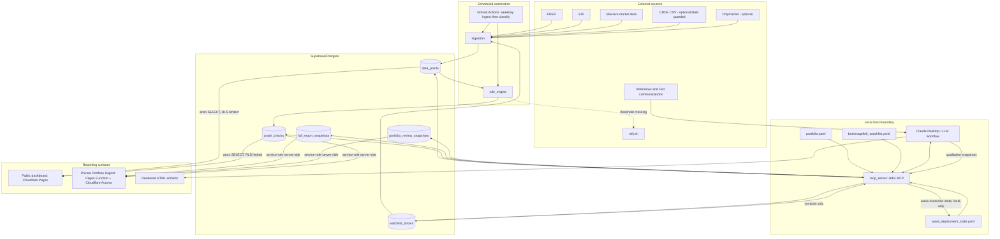

# Macro Market Stress Monitor — Architecture & Rules Summary (for external AI review)

This is a self-contained briefing for a fresh model/chat with no other context on this
project. It covers system architecture, data flow, security model, prior external-review
findings and their current status, and the full current rules (thresholds/bands/formulas)
that govern the crash-detection and wave-deployment logic. Paste this whole document as
context when asking another model to analyze or propose changes to the system — nothing
here is sensitive (no dollar figures, no credentials, no personal account data).

**This document supersedes the separate `architecture-review.md`** (a prior external
review, dated 2026-08-14) — its findings are folded into the "Prior architecture review:
findings and current status" section below rather than kept as a standalone file, so
there's one place to read instead of two overlapping ones.

## What this system is

A market-crash-monitoring pipeline that replaced a giant hand-updated prompt with a
small, deterministic pipeline: live data ingestion → a rule engine that classifies
market conditions → a local MCP server exposing tools to Claude Desktop → two
reporting surfaces (a rich on-demand chat report, and two public/private web
dashboards).

**Core design philosophy: numeric classification is never an LLM's job** — for the parts
that are actually mechanical. Every threshold, band, RED/AMBER/GREEN color, confirmation
window, and wave trigger is computed by plain deterministic code from real market data —
never inferred, estimated, or "reasonably judged" by an LLM at report time.

**This is not true of everything the system produces, and the system now says so
explicitly** (added 2026-08-15, after an external investment-model review flagged the gap
between this framing and reality — see below). Crash probability, crash-type diagnosis,
scenario distribution, and the Warsh Fed classification are LLM/human qualitative
judgment, not rule-engine output — informed by the deterministic panel and web research,
but with no defined forecast horizon, no historical labels, no out-of-sample validation,
and no reliability testing behind them. **This system is best described as a
stress-monitoring and discretionary deployment dashboard, not a calibrated
crash-probability model** — treat the displayed probability as a considered opinion, not
a statistic, and do not treat the three-wave deployment thresholds as empirically
optimal.

## Architecture

### Layers

| Layer | What it does | Where |
|---|---|---|
| **Rules** | Static thresholds, bands, wave-deployment percentages, crash-type diagnosis criteria | `reference_docs/rules/crash-check-rules.md` (full text reproduced below) |
| **Ingestion** | Pulls FRED/EIA macro series (full available history since 2026-08-15, not a rolling 5yr window) + Massive.com watchlist ticker prices daily | `ingestion/` (GitHub Action, `.github/workflows/ingest.yml`, 10am ET weekdays) |
| **Rule engine** | Computes the 6-indicator RED/AMBER/GREEN panel, confirmation windows, wave authorization (relative-drawdown triggers since 2026-08-15), cross-indicator divergence detection, threshold-crossing push notifications — pure functions, no LLM | `rule_engine/` |
| **MCP server** | Local stdio server exposing tools to Claude Desktop (indicator panel, portfolio drift, watchlist status, deployment plan, 5 write/persistence tools, data-freshness check) | `mcp_server/` |
| **Reporting** | Chat-rendered HTML reports (2 templates), a public historical dashboard, and a private "Private Portfolio Report" page merging crash-check + portfolio-review content | `reference_docs/rules/*.html`, `dashboard_site/`, `full_report_site/` |

## The 6-indicator panel (the deterministic gate)

VIX, HY credit spreads, S&P drawdown from ATH, 10yr Treasury yield, the Sahm Rule, and
Fed pivot signal. Wave deployment (a staged, 3-tranche dry-powder deployment plan)
authorizes only when 3+ are simultaneously RED, **and** each RED reading has held
across 2+ distinct daily ingestion dates (not just repeated same-day checks) — see
Signal Tiering below. Full thresholds and wave math are in the rules doc reproduced
in full below.

## Wave deployment & authorization (fixed 2026-08-15)

An architecture review (2026-08-14) and an investment-model review (independently)
both identified the same material gap: `get_deployment_plan` checked only `wave_active`
(the S&P-drawdown/VIX price trigger) and never `wave_authorized` (the confirmed
3-of-6-RED gate) — a single unconfirmed volatile day could surface a real dollar
deployment plan. Three fixes shipped together:

1. **Both gates now required.** `get_deployment_plan` denies with an explicit
   "observed, not yet authorized" message if `wave_active` is set but `wave_authorized`
   is false — closing the bypass. This makes authorization *stricter* than before, not
   looser (see "still open" below re: whether that direction is even correct).
2. **Relative drawdown thresholds, not fixed S&P levels.** `activeWave()` (`rule_engine/
   src/rules.ts`) now triggers on ATH-relative drawdown % (16/24/35 for Waves 1/2/3)
   instead of fixed nominal S&P levels (previously 6,200/5,600/4,800) — a fixed level
   decays in meaning as the index's all-time high rises over time; a drawdown
   percentage doesn't.
3. **Cumulative, execution-aware deployment.** Previously, a market move deep and fast
   enough to satisfy Wave 3's condition without Wave 1/2 ever separately confirming
   would return *only* Wave 3's fund allocation, silently skipping the diversification
   Wave 1/2 were meant to add. `get_deployment_plan` now returns the combined breakdown
   for every not-yet-executed wave up to and including the current one. A new local file
   (`local_state/wave_deployment_state.yaml`, same trust boundary as `portfolio.yaml`)
   and MCP tool (`record_wave_deployment`) track which waves have actually been
   executed, so a wave already acted on isn't re-proposed.

**Still open**: whether the joint drawdown-AND-VIX construction and the "3-of-6 RED"
authorization rule are themselves well-calibrated remains unresolved — a real backtest
against 2020 data found the current thresholds already miss real episodes in both
directions (Wave 3 never fired in 2020 despite VIX hitting 82; Wave 2 never fired in the
2022 grinding bear market). Requiring `wave_authorized` in addition to the price/VIX
trigger makes the system stricter, which cuts against that finding rather than resolving
it. Recalibrating the actual threshold values needs real backtested evidence — deferred
to future hazard-model work (see below), not guessed at.

## Cross-indicator divergence detection (documented in the rules doc since 2026-08-16)

Four pairs of normally-correlated series are checked daily for a 7-day-delta
split large enough to suggest they've decoupled — a relationship-level signal
the 6-indicator panel's individual bands can't see on their own:

- **IG vs. HY credit spreads** — IG widening while HY holds flat can read as
  an early quality-flight signal ahead of the gating HY spread moving.
- **Initial vs. continuing jobless claims** — continuing claims rising while
  initial claims stay flat suggests laid-off workers are taking longer to
  find new jobs (labor-market cooling, distinct from a fresh layoff wave).
- **VIX vs. HY credit spreads** — the one pair where a flagged divergence is
  the *reassuring* reading, not the concerning one: VIX spiking without HY
  confirming reads as equity-specific noise, not stress broad enough to move
  credit markets. Consumers of this flag must not treat "diverging" as
  uniformly bad across all four pairs.
- **HY widening vs. VIX calm** *(added 2026-08-16)* — the reverse of the pair
  above, and previously the more concerning missing direction: credit stress
  surfacing before equity vol does (credit often leads equity). Thresholds
  deliberately reuse the VIX-vs-HY pair's own two constants (5bps, 3pts),
  flipped, rather than a fresh unbacktested number.

Computed once daily inside `rule_engine`'s `classify()`, persisted to
`crash_checks.divergence_flags` (each entry carries both series' current
value and 7-day delta, not just a boolean) — `mcp_server`'s
`get_context_indicators` and `dashboard_site`'s "Signal Relationships" card
both read that one persisted value rather than each computing their own copy,
consistent with the Rule Engine Output Contract below. Thresholds are a first
cut, not backtested/calibrated. **Known data limitation**: the two credit-spread
series feeding 3 of these 4 pairs only have real history back to
2023-07-11/2023-07-17 in this database (not the 1996 inception commonly cited
for these FRED series — verified, not an ingestion bug), meaningfully limiting
how far back any future calibration of these thresholds can be checked. Not
part of the 3-of-6 wave-authorization gate — informational only, same tier as
the other contextual indicators. Still deliberately deferred: rolling-
correlation infrastructure, and a regime-dependent 10yr-Treasury-vs-equities
pair (needs the regime concept from the future hazard-model work to mean
anything, not a naive non-regime-aware version now).

## Stage 4 recovery-transition detection (built 2026-08-16)

The rules doc's "Recovery Signal and 6-Month Transition" section was pure
prose with zero corresponding code until this date. Detection (not execution
tracking — see below) is now real:

- **Trough tracking**: a running minimum of the S&P level, tracked only while
  a drawdown episode is active (drawdown ≥10% from ATH — the same threshold
  the Crash Mode Protocol RED ALERT banner already uses, not a separately
  invented number). Resets to null once drawdown falls back under 10%.
- **VIX sustained below 25 for 3+ weeks**: reuses the same confirmation-streak
  mechanism as the 6-indicator panel (`computeConfirmation`, now generalized
  with an optional `requiredCount` parameter, default 2 — unchanged for the
  existing 5 indicators), applied here with `requiredCount: 15` (~3 weeks of
  trading days) as a separate `vix_recovery` confirmation entry.
- **Fed criterion** reuses `fed_pivot_signal === "CUT"` directly rather than a
  new field — the "within 2 meetings" recency qualifier is explicitly *not*
  independently tracked, same honesty-first treatment as every other
  manual/LLM-judged field in this system.
- `recovery_confirmed` is true once all three criteria hold simultaneously,
  and persists as a historical fact about the most recent episode until a
  *new* episode begins.

**Still manual**: the month-by-month glide-path execution tracking (which
step you're actually on) has no equivalent of `wave_deployment_state.yaml`/
`record_wave_deployment` yet — `recovery_confirmed` tells you *whether* to
start the table, nothing tracks *where* in it you are. Deliberately deferred
as a smaller follow-up once detection was proven live.

## Security model — split storage (why this matters for any rule changes)

- **Supabase** holds macro/market data only — VIX, CPI, wave status, indicator
  colors, crash probability, watchlist ticker prices/targets, and crash-type
  diagnosis narrative and Portfolio Opportunity Review content (drift %, ticker
  thesis, risk-radar scores). **No dollar figures, no account balances, ever** —
  enforced in code (`findLeakedDollarFigures()`), not just by prompt instruction:
  every write path that persists free text cross-references the real portfolio
  file's dollar figures and throws if any appear, rather than trusting the model
  to have followed a "don't include $" rule correctly every time.
- **`local_state/`** (gitignored, never committed, never leaves the machine) holds
  the real portfolio file — account balances, dry powder, allocation targets —
  the BrokerageLink watchlist's position-sizing (`max_position_usd`, which *never*
  reaches Supabase even though everything else about the watchlist now does), and
  (since 2026-08-15) which wave-deployment tranches have actually been executed
  (`wave_deployment_state.yaml`) — action state tied to real trades, same trust
  boundary as the rest of this directory.
- **The MCP server runs locally via stdio**, not as a hosted service — it's the
  one component that touches `local_state/`.
- Wave-deployment amounts in the rules doc are percentages of "dry powder," never
  dollar figures — the MCP server combines the percentage with the real, local-only
  balance at read time, and that computation's output is chat-only, never
  persisted.
- The private "Private Portfolio Report" page (`full_report_site/`, renamed
  from "Full Report" 2026-08-17 — the old name collided with `dashboard_site`'s
  own unrelated "Full Report" row-type label) is gated by Cloudflare Access
  (email one-time-PIN, plus a GitHub OAuth identity provider added 2026-08-16
  as a lower-friction second option) *and* reads Supabase server-side with a
  `service_role` key that's never shipped to the browser — closing the
  access-control gap by design rather than relying on Access alone (a plain
  client-embedded anon key with broad SELECT would bypass Access entirely if it
  existed).

## The five MCP write/persistence tools

1. `write_snapshot` — persists the qualitative crash-check synthesis (probability,
   scenario distribution, narrative notes) to `crash_checks`. Fixed 2026-08-16:
   previously, changing `fed_pivot_signal` here (e.g. NONE→CUT) updated
   `fed_pivot_color` but left `red_count`/`confirmed_red_count`/`wave_authorized`
   stale, carried forward verbatim — now recomputed from the other 5
   carried-forward colors plus the new fed-pivot color, mirroring `classify.ts`'s
   own formula. `confirmation_state` itself (the per-indicator streaks) stays
   untouched — only the aggregate counts derived from it refresh.
2. `write_full_report` — persists watchlist status (recomputed server-side from
   live prices, not trusted from the caller), crash-type diagnosis, and
   qualitative-only portfolio context to `full_report_snapshots`.
3. `write_watchlist` — full-replacement update of the BrokerageLink watchlist
   (targets, thesis, position sizing locally; symbols only synced to Supabase).
4. `write_portfolio_review` — persists a Portfolio Opportunity Review's verdict,
   summary, macro cross-reference, per-ticker thesis re-underwrite, and risk-radar
   scores to `portfolio_review_snapshots`; portfolio drift is recomputed
   server-side, not trusted from the caller.
5. `record_wave_deployment` *(added 2026-08-15)* — marks a wave as actually executed
   (local-only, `wave_deployment_state.yaml`) after real trades are placed, so
   `get_deployment_plan` stops re-proposing it. Deliberately separate from the
   read-only `get_deployment_plan` call — computing a plan never has side effects.

All five run the dollar-figure guardrail against every free-text field before
writing (tools 1–4; `record_wave_deployment`'s inputs carry no free text).

## Anti-anchoring design (crash-check workflow ordering)

The daily "run crash check" workflow deliberately avoids showing the model any
prior probability/narrative until *after* it commits to this run's estimate — steps
are ordered so the indicator panel, contextual macro data, and portfolio snapshot
are read first, the model commits to a probability + scenario distribution using
only that data, and *only then* does it fetch the prior report's stored probability
(to build a delta-log/framing comparison, never to revise the number already
committed to). This exists because an earlier version let the model see its own
prior narrative before forming a new judgment, which produced anchoring instead of
independent daily assessment.

## Signal confirmation (avoiding single-noisy-day false triggers)

A RED reading on any of the 6 core indicators only counts toward wave authorization
once it has held across **2 or more distinct daily ingestion dates** — not just
repeated intraday checks against the same day's already-ingested value. This closes
an asymmetry where the original design required VIX sustained below 25 for 3 weeks
to declare recovery, but required zero persistence at all to authorize a real-money
deployment. The rule engine tracks this via a per-indicator streak counter
(`confirmation_state` jsonb column, `confirmed_red_count` derived from it) —
`wave_authorized` gates on the *confirmed* count, not the raw same-day count. The
same mechanism (`computeConfirmation()`) was generalized 2026-08-16 with an
optional `requiredCount` parameter (default 2, unchanged for these 5 indicators)
so the "VIX sustained below 25 for 3 weeks" side of that asymmetry could finally
be implemented too, not just cited as the historical justification — see "Stage 4
recovery-transition detection" above.

**2026-08-15 historical check**: an investment-model review argued this 2-day rule
creates false negatives in fast, event-driven crashes (citing Feb–Mar 2020). Queried
real `data_points` history rather than assuming: VIX confirmed RED by 2020-02-28,
three-plus weeks before the actual bottom; the S&P drawdown band confirmed RED by
2020-03-17, six days before the bottom (2020-03-23). On the two indicators verifiable
against current data, confirmation cleared with real runway to spare — not obviously
the dominant source of lag in this one episode. Not conclusive (HY spread data doesn't
go back that far in this database, and Fed pivot's manual judgment is a wildcard), and
no rule was changed on the strength of one partially-verifiable episode — see the full
finding in the rules doc below.

## Data-freshness guardrail

Before trusting the indicator panel as "today's data," the system compares the
latest `crash_checks` row's date (in America/New_York) against the expected
ingestion date (accounting for weekends — ingestion is weekdays only), and stops
with an explicit warning rather than silently analyzing stale data if ingestion
hasn't run yet. This exists because GitHub Actions' cron scheduler has been
observed firing up to ~60 minutes late in this project's real run history, so naive
fixed-offset scheduling (e.g. "run analysis 30 min after ingestion") isn't reliable
on its own.

## Threshold-crossing push notifications

A free ntfy.sh push notification fires the moment `confirmed_red_count` crosses
*up* into 2+ (not on every day it remains there) — runs inside the same daily
ingestion job, comparing today's row against the prior row to detect the
transition rather than just checking the current level.

---

# Prior architecture review: findings and current status

A full external architecture review (2026-08-14, `architecture-review.md`, since
folded into this document) scored the system 7.4/10 — "a thoughtfully layered,
single-user market-monitoring system" held back by "high-impact correctness risks
rather than implementation maturity." Its findings, and what's happened since:

## Strengths identified (still true, unchanged)

1. Security boundary matches data sensitivity — local financial state stays local;
   public/private data genuinely separated; private browsing never gets a service-role key.
2. Mechanical signals are reproducible — raw observations, derived states, and
   divergence results are persisted, not recomputed independently per view.
3. Safety controls are layered — required-source failure, plausibility quarantine,
   freshness checks, confirmation windows, idempotent writes, transition-only notification.
4. The LLM has a narrow, useful role — qualitative value added without letting it
   invent core numeric classifications.
5. The architecture is proportionate — serverless scheduling, Postgres, static public
   reporting, and a local stdio bridge, appropriate for a single-owner system.

## Fixed since the review

- **The deployment-authorization gap** ("the most consequential architectural finding" —
  `get_deployment_plan` deployed on `wave_active` alone, never checking `wave_authorized`)
  — fixed 2026-08-15, see "Wave deployment & authorization" above.
- **Fixed S&P wave-level decay** — wave triggers switched to ATH-relative drawdown %.
- **"Wave 3 fires first" / no execution-state problem** — fixed via cumulative
  deployment + `wave_deployment_state.yaml` + `record_wave_deployment`.
- **Specification/runtime honesty gap re: crash probability and crash type** — the
  rules doc previously claimed the rule engine owned the crash-probability score and
  crash-type triggers while a separate section admitted both are 100% LLM judgment; the
  contradiction is now resolved, and the doc states plainly what's deterministic vs.
  qualitative (see "What this system is" above, and "What this system actually is" in
  the rules doc below). The same caveat now appears next to every surfaced probability
  figure on the public dashboard and the private Portfolio Report — not just in the rules doc.
- **Missing-indicator gaps (partial)** — 5 new verified free FRED series added
  (`SOFR` for repo/liquidity stress, `DTWEXBGS` for the dollar-transmission leg,
  `NFCIRISK`/`NFCICREDIT` for bank-funding/credit-conditions stress, `DFII10` for the
  real-yield leg of equity valuation). A 6th candidate (`OECDLOLITOAASTSAM`, a global-PMI
  stand-in) was tried and dropped after verification showed it frozen since 2022-11 —
  removed rather than shipped with a misleading caveat.
- **"Never sell on the way down" liquidity/concentration/tax-status concern** — reviewed
  against the actual account schema; the two accounts it would plausibly apply to are
  already excluded from wave deployment by their own flags. No code change needed;
  documented in the rules doc so it doesn't get re-flagged as an open gap later.
- **`write_snapshot`'s stale-field inconsistency** (Fed-pivot judgment change not
  triggering a `red_count`/`confirmed_red_count`/`wave_authorized` recompute) —
  fixed 2026-08-16, see "The five MCP write/persistence tools" above. This was
  listed as a known-unfixed inconsistency in the original review; it no longer is.
- **Stage 4 recovery-transition tracking** — was "pure prose, zero code"; detection
  (trough tracking, VIX-sustained-25 window, the composite gate) is now built and
  verified live, 2026-08-16. Execution tracking (which month/step) is still manual
  — see "Stage 4 recovery-transition detection" above for the exact split.
- **Divergence detection's missing "HY widening without VIX confirming" direction**
  — added 2026-08-16 as the 4th pair. Rolling-correlation infrastructure and the
  regime-dependent 10yr-vs-equities pair remain deferred (see above).
- **A real bug found and fixed along the way, not from either original review**:
  `write_snapshot` was silently dropping `divergence_flags` on every full
  chat-triggered report (no DB default on that column), so the dashboard's
  "Signal Relationships" card vanished on exactly the report type most likely to
  be read closely, while working fine on bare automated refreshes. Fixed
  2026-08-16 by carrying the field forward like every other rule-engine-owned
  mechanical field.

## Still open

- **Rules are duplicated across prose (rules doc) and code (`rule_engine`, `mcp_server`,
  `dashboard_site` all independently re-encode the same thresholds/splits).** No shared
  executable rules package exists yet. Every change so far has been made by hand-editing
  each location in sync — works, but has no compile-time guarantee they stay in sync.
- **Qualitative state (crash probability, crash type, Warsh classification, trigger
  status) still lacks provenance/versioning.** Fields are copied forward from the prior
  `crash_checks` row rather than referencing an explicit source/effective/expiry model.
  (The specific Fed-pivot/red-count staleness inconsistency this originally also
  flagged is now fixed — see "Fixed since the review" above; the broader
  provenance/versioning gap is not.) Separately, trigger re-checking itself had the
  same class of problem at the *instructions* level, not code: `trigger_status` was
  being carried forward unchecked across reports even when the underlying condition
  had genuinely changed (found live 2026-08-17 — a rate-reset trigger stayed stuck on
  a stale note for 3 consecutive reports after the actual rate was updated locally).
  Fixed by making trigger re-verification an explicit required step in
  `project-instructions.md` rather than a passive "only if you happen to notice" one.
- **No rule-state/workflow contract test suite exists.** Verification for every change
  in this project so far has been `tsc --noEmit` plus manual/throwaway scripts — real,
  but not a durable regression suite for threshold boundaries, confirmation timing, or
  deployment-denial-before-authorization.
- **No ingestion run/per-series health record.** A dataset-freshness decision exists at
  the whole-run level (see "Data-freshness guardrail" above) but not per-series — a
  successful run can still contain stale weekly/monthly observations for some series.
- **Public dashboard's `crash_checks` history read is a flat `limit=1000`, unpaginated**
  — will silently truncate once history grows past that. `data_points` reads are already
  paginated; `crash_checks` is not.
- **The Private Portfolio Report's service-role key is broad and long-lived** in the
  Cloudflare Pages environment — not yet narrowed to a dedicated read-only role/function.
- **Stage 4 recovery-transition *execution* tracking** — detection is now built (see
  above); the month-by-month glide-path execution state (which step you're actually
  on) is still manual, no `wave_deployment_state.yaml`-equivalent exists for it yet.
- **The full hazard-probability model / regime detection / expected-utility deployment
  policy** the investment-model review called for (see below) — not started. This is the
  single largest remaining item, deliberately deferred to a Python research pipeline
  (statistical tooling this repo doesn't have) with real backtest data, rather than
  attempted piecemeal. Two external, published, backtested recession-probability models
  (Chauvet-Piger via FRED, and the NY Fed's Estrella-Mishkin formula computed locally)
  were added 2026-08-17 as calibration cross-checks in the meantime — they inform the
  narrative, they do not calibrate this system's own crash-probability estimate.
- **BrokerageLink watchlist ticker selection** still has no documented "why this ticker"
  rationale beyond a one-line theme tag.
- **Divergence-detection remaining scope**: rolling-correlation infrastructure and a
  regime-dependent 10yr-vs-equities pair remain deliberately deferred, not started.

---

# Prior investment-model review: findings and current status

A separate CIO/quant-perspective review (`investment-model-review.md`, since folded into
this document) disagreed with the system as a capital-allocation model — "a useful
dashboard of stress indicators, but not a calibrated crash-probability model or a robust
deployment policy." Status of its 8 sections, condensed (see the earlier fixes above for
detail on what shipped):

| Section | Status |
|---|---|
| 1. Crash probability isn't a real probability model (no event/horizon, unbacktested) | Honestly labeled everywhere it's shown (2026-08-15); still not calibrated — that's the deferred model work |
| 2. Regime detection is reactive and internally inconsistent (correlated indicators, subjective Fed-pivot, useful indicators excluded from the gate) | Untouched |
| 3. Wave deployment — fixed levels, bypassed authorization, "3-of-6" unsound, no cumulative state | Fixed levels, bypassed authorization, and no-cumulative-state all fixed 2026-08-15; "3-of-6" statistical soundness untouched |
| 4. Determinism ≠ validity (2-day confirmation false negatives, blanket "never sell," fixed 6-month recovery) | 2-day confirmation investigated and documented (not changed); "never sell" reviewed and confirmed already-handled; 6-month recovery *detection* now built (2026-08-16) — execution tracking still deferred |
| 5. Missing indicators (valuation, breadth, credit structure, liquidity, growth, inflation, global transmission, event risk) | Liquidity, credit-structure, and dollar-transmission gaps partially filled; valuation partially filled (real-yield leg only); breadth, CDS, cross-currency basis, dealer balance sheets, and true global PMI confirmed to have no free data source — documented as real gaps. Two external published recession-probability models added 2026-08-17 as citations (not a fix to this system's own calibration) |
| 6. Six named error modes | All still live — none directly targeted yet |
| 7. Two-layer hazard model + expected-utility deployment policy | Not started — the deferred follow-up |
| 8. Calibration standard (OOS testing, reliability curves, Brier score, block bootstrap) | Doesn't exist — the 2020 confirmation-window check was a one-off spot-check, not this infrastructure |
| Bottom line: relabel honestly as a stress-monitoring dashboard | **Done** (2026-08-15) |

---

# Full current rules doc (source of truth — reproduce verbatim below)

The following is the complete, current contents of `reference_docs/rules/crash-check-rules.md`
— this is what actually drives the deterministic rule engine (`rule_engine/src/rules.ts`,
`rule_engine/src/classify.ts`). Any proposed rule changes should be expressed as edits
to this document.

<!-- BEGIN crash-check-rules.md -->

# Crash Check — Rules Layer (Sanitized) — v5

Derived from the local master prompt doc (`MACRO CRASH CHECK — MASTER PROMPT v3.md`,
kept out of git — see `.gitignore`). This file contains only the static, reusable
rules: thresholds, bands, classification criteria, and allocation *percentages*.

**No personal account balances or dollar figures appear in this file.** Wave
deployment and allocation amounts below are expressed as a percentage of the
tactical account's "dry powder" pool. The rule engine (Stage 3) combines these
percentages with the live `dry_powder_usd` figure from `local_state/portfolio.yaml`
(gitignored, local-only) to compute actual dollar amounts — that computation and
its output happen client-side and are never written back to Supabase.

This file is the source of truth for Stage 3 (rule engine). If you edit the
original master prompt doc, mirror any rule/threshold changes here.

> **Changelog vs. v3, consolidated:** (1) added the Layer Boundary section
> below — every rule in this file must be codeable as a deterministic
> comparison; anything that can't be is flagged as an open item, not
> softened into an LLM judgment call. (2) Added Signal Tiering & a
> Confirmation rule (Tier 1 vs. Tier 2 indicators; a threshold breach must
> hold across 2+ distinct daily ingestion dates, not just repeated same-day
> checks, before it authorizes a wave or flips a crash type) — this closes
> an asymmetry where Stage 4 recovery required VIX sustained below 25 for 3
> weeks but wave entry required zero persistence at all. (3) Replaced every
> vague qualifier (bank stress "rising," capex "cuts," claims "sustained
> rising trend," delinquency "rising," breakeven "meaningfully above") with
> numeric proxies, each marked `[new default — calibrate]` so you can tell
> what's inherited vs. what needs your sign-off before it's load-bearing.
> **All 9 were reviewed and approved as-is on 2026-07-11** — the tags below
> are left unmarked now that they're settled, not because they're
> unimportant. Revisit if real-world backtesting later suggests a
> proxy/threshold isn't holding up.
> (4) Added a draft Crash-Probability Scoring Methodology, since no version
> of this file ever specified how the displayed % is computed — checked
> against the actual code (2026-07-11): it's 100% LLM-judgment today
> (`classify.ts` never touches it), which turned out to be a deliberate
> decision from early in the project, not an oversight. The scoring formula
> stays **deferred** (draft only); what was a real bug — the LLM anchoring
> to its own prior probability/notes instead of judging independently each
> run — was fixed separately at the instruction + tool level (commit
> `5d791f1`), without changing who computes the number. (5) Standardized
> 3-day/7-day delta reporting,
> confidence tagging, and a fixed dashboard scan order, and distinguished
> "automated indicator refresh" runs from "full chat-triggered report" runs
> (observed as an already-real distinction in exported output that the
> rules never formalized).

---

## Layer Boundary (read this first)

This system's own design philosophy states: **"No LLM does numeric
classification. Every threshold, band, and RED/AMBER/GREEN color is computed
by deterministic code... never inferred by an LLM."** Everything below is
written to that standard, and this section makes the standard explicit so
future edits don't drift from it.

**Rule engine (deterministic, layer 3) owns:** every threshold and band in
this file, the 3-of-6 wave gate, and the confirmation/persistence logic. All
of it gets written to the "current state" table. None of it is inferred,
estimated, or "reasonably judged" by an LLM at report time.

**LLM narrative/qualitative layer (reporting) owns:** the crash-probability
score, the crash-type diagnosis, and scenario distribution — despite the
Stage 1 criteria below being written with hard numeric triggers, `crash_type`
is never computed by the rule engine; it's only ever set by a caller-supplied
input to `write_snapshot`. Same for crash probability (see the "Crash-
Probability Scoring Methodology" section — deferred, never implemented; the
number is 100% LLM judgment today). This is a **deliberate, pre-existing
design decision**, not an oversight this doc failed to catch — but it means
this section previously overstated what's actually deterministic, and this
paragraph exists to correct that rather than let the contradiction stand.
The LLM layer also reads news and Fed communication to inform the Warsh
classification (an explicitly flagged manual judgment call — see below), and
renders the dashboard from values the rule engine already computed for
everything it *does* own. It **renders, it does not recompute** — if the
rule engine says confirmed RED, the report says confirmed RED; it doesn't
get softened, hedged, or independently re-estimated in prose.

**The test for every rule in this file:** could a developer implement it as
an `if`/`else` without asking what you meant? If yes, it belongs in a
section below, stated as a hard number. If no — as with Warsh MODERATE/
DOVISH criteria, crash-type diagnosis, and crash probability — it stays an
explicitly flagged manual/LLM judgment call, never a silently softened
threshold. Vague language in this file isn't just an "AI might interpret
loosely" risk — it's a spec that literally cannot be coded as written, which
is a harder failure mode for a system whose entire premise is that
*mechanical* classification (bands, confirmation, wave gates) is
deterministic — the qualitative layer (probability, crash-type, narrative)
was never meant to be, and should not be presented as if it were.

---

## What this system actually is

**This is a stress-monitoring and discretionary deployment dashboard, not a
calibrated crash-probability model.** The 6-indicator panel, band colors,
confirmation windows, and wave-trigger thresholds are genuinely deterministic
— reproducible, inspectable, and owned entirely by code. The crash
probability, crash-type diagnosis, scenario distribution, and Fed/Warsh
classification are not: they are a single person's (via an LLM) qualitative
judgment, informed by the deterministic panel and web research, with no
defined forecast horizon, no historical labels, no out-of-sample validation,
and no reliability testing behind the displayed percentage. A crash
probability of 15% is not evidence that a crash-defining event will occur
roughly 15% of the time — treat it as a considered opinion, not a statistic.
This system should never be presented or relied upon as if the three-wave
deployment thresholds were empirically optimal, or as if the probability
score were calibrated — because neither is true today.

---

## Signal Tiering & Confirmation Windows

Every indicator used anywhere in this file is one of two tiers. This section
is the single source of truth for how "signal" is separated from "noise" —
every other section below refers back to it instead of re-deriving the logic.

**Tier 1 — structural, gates capital.** Slow-moving, low false-positive rate,
the only indicators allowed to authorize wave deployment or flip a crash-type
classification: VIX, HY credit spreads, S&P drawdown from ATH, 10yr Treasury
yield, Sahm Rule, Fed pivot signal, 2s10s yield curve, unemployment rate, CPI.
Each is read at check time (checks run ~6–7x/day) — persistence is enforced
by the streak-counter confirmation rule below, not by waiting for a specific
daily close.

**Tier 2 — flow/sentiment, narrative only, never gates.** Fast-moving, noisy,
useful for color and for adjusting the *confidence* tag on a probability
estimate, but never sufficient alone to fire a wave or change a crash type:
retail sales, credit card delinquency, weekly initial jobless claims (the raw
weekly print — the 4-week moving average is what's allowed to matter), overnight
reverse repo, single-day volume/breadth chatter, any retail-sentiment or social
read.

**Confirmation rule.** The live system already computes and displays a
per-indicator streak counter (e.g., "GREEN for 13 checks, since Jul 9") — this
rule governs *that* field rather than inventing a parallel mechanism, and
should be computed in the deterministic rule engine (layer 3), written to the
"current state" table alongside RED/AMBER/GREEN — not left to the LLM
reporting layer to track. Because ingestion is daily but the dashboard checks
~6–7x/day (observed: 13 checks over 2 calendar days), most checks re-evaluate
the *same* day's already-ingested value — so a raw check-count is not
independent confirmation, it's the same data point counted repeatedly. The
rule engine should instead track **distinct ingestion dates**: any Tier 1
threshold that would authorize a wave or flip a crash type must hold across
**2 or more separate daily ingestion runs** (i.e., the breach must still be
true the next time fresh data lands, not just the next time the dashboard
re-renders). Until a second distinct day confirms it, the dashboard shows the
indicator as "RED — pending confirmation (1 of 2 days)," not as authorizing.
This closes the asymmetry in v3, where Stage 4 recovery required VIX
sustained below 25 for 3 consecutive *weeks* but wave entry required zero
persistence at all — without this fix, a single volatile trading day could
still authorize a real-money deployment the moment that day's data lands,
and a high same-day check frequency would create the illusion of a "streak"
that isn't really independent confirmation.

> **2026-08-15 historical check (finding, not a rule change):** an external
> quant review argued this 2-day rule creates false negatives in fast,
> event-driven crashes (citing Feb–Mar 2020 as the canonical example). Queried
> real `data_points` history for that window rather than assuming either way:
> VIX crossed into confirmed RED (>35, 2 distinct dates) by **2020-02-28** —
> three-plus weeks before the actual market bottom. The S&P drawdown *band*
> (>20%, one of the six RED-count indicators) reached confirmed RED by
> **2020-03-17**, six days before the bottom (2020-03-23), while VIX had
> already been RED for weeks. On the two indicators checkable against real
> data, confirmation cleared with real runway to spare — it wasn't obviously
> the dominant source of lag in this one episode. This is **not conclusive**:
> `BAMLH0A0HYM2` (HY spread) has no rows before ~2023 in this database, so the
> full 3-of-6 `wave_authorized` timeline for 2020 can't be reconstructed, and
> Fed pivot's manually-judged, confirmation-exempt status is a wildcard this
> check can't account for either. No rule was changed on the strength of one
> partially-verifiable episode — a magnitude-based fast-confirmation path
> would be a new, unvalidated policy choice, not a fix, and stays out of scope
> until real backtesting (the deferred hazard-model work) can support it.

**Escalation without gating.** Sustained Tier 2 deterioration — 3 or more Tier
2 indicators moving in the adverse direction across 4+ consecutive weekly
readings — never flips a hard gate, but must raise the confidence qualifier on
the crash-probability estimate (Low → Medium → High persistence; see
Formatting Requirements). This is how systemic drift gets surfaced without
letting daily retail-sentiment noise touch the deployment logic.

---

## Crash Mode Protocol

If the S&P 500 has fallen **≥10% from its most recent all-time high**
(confirmed per the Signal Tiering rule above — true across 2+ distinct
ingestion dates, not just repeated same-day checks) since the last check,
lead with a RED ALERT banner: drawdown % from ATH + exact S&P level, which
wave threshold is triggered (1/2/3/none), how many of the 6 indicators are
RED, each RED indicator's confirmation status (confirmed vs. pending — with
days-confirmed count shown), and deployment action. Skip macro narrative
preamble in this mode.

## 6-Indicator Panel (RED/AMBER/GREEN bands)

All Tier 1, computed deterministically by the rule engine at each ingestion;
persistence enforced via the confirmation rule above (2+ distinct ingestion
dates), not a single day's snapshot.

| # | Indicator | GREEN | AMBER | RED |
|---|---|---|---|---|
| 1 | VIX | <20 | 20–35 | >35 |
| 2 | HY credit spreads (ICE BofA) | <350bps | 350–500bps | >500bps |
| 3 | S&P drawdown from ATH | <10% | 10–20% | >20% |
| 4 | 10yr Treasury yield | <4.3% | 4.3–5.0% | >5.0% |
| 5 | Sahm Rule reading | <0.3 | 0.3–0.5 | >0.5 |
| 6 | Fed pivot signal | None | Pause language | Cut signal |

**Wave deployment is authorized when 3 or more of the 6 indicators are
simultaneously RED, each independently confirmed** per the Signal Tiering
rule (true across 2+ distinct ingestion dates). A RED reading that hasn't
cleared confirmation counts toward the "pending" tally shown in the
dashboard, not the authorizing tally — e.g. "1 of 6 RED confirmed, 1 pending
(confirmed on 1 of 2 required days)."

Additional bond-market bands (Tier 1, elevated priority, informational):
- 10yr Treasury: amber above 4.5%, RED above 5.0%
- 30yr Treasury: above 5.0% = bond vigilante signal
- Rate hike probability (CME FedWatch): flag if >30% for any meeting in the cycle
- Shiller CAPE: flag above 35x as extreme

## Wave Deployment Thresholds (tactical account only)

Deploy in 3 waves only — **never all at once, never two waves in the same
week.** Amounts are % of the account's dry-powder pool (see
`local_state/portfolio.yaml` for the live dollar figure). All S&P
drawdown/VIX conditions below require confirmation per the Signal Tiering
rule — true across 2+ distinct daily ingestion runs, not just repeated
intraday checks against the same day's data — a single volatile trading day
does not authorize deployment, even once that day's data has landed.

Triggers are expressed as **drawdown from the running all-time-high**, not
fixed nominal S&P index levels — a fixed level like "S&P ≤ 6,200" decays as
the index's nominal level rises over time (what was a ~16% drawdown when
that number was chosen becomes a smaller, less meaningful move once the ATH
has risen further), while a drawdown percentage stays meaningful regardless
of when it's evaluated.

A wave's drawdown/VIX condition being met is **not, by itself, authorization
to deploy** — `get_deployment_plan` also requires `wave_authorized` (3 or
more of the 6 indicators confirmed RED, per the wave-deployment-authorization
rule above). A wave whose drawdown/VIX threshold has fired but where
`wave_authorized` is still false is shown as observed-but-not-yet-authorized,
not as a deployable plan.

**WAVE 1 fires when:** S&P drawdown from ATH ≥ 16% AND VIX > 28, both confirmed
→ Move **~17.4% of dry powder**, split:
- 50% → Healthcare-sector defensive equity fund
- 25% → Real-estate/real-asset fund
- 25% → International equity (add to existing position)

**WAVE 2 fires when:** S&P drawdown from ATH ≥ 24% AND VIX > 35, both confirmed
→ Move **~21.7% of dry powder**, split:
- 40% → Target-date/glide-path fund (add)
- 32% → International equity (add again)
- 16% → Energy sector ETF (via brokerage window)
- 12% → Inflation-protected securities (TIPS, via brokerage window)

**WAVE 3 fires when:** S&P drawdown from ATH ≥ 35% AND VIX > 45, both confirmed
→ Move **~17.4% of dry powder**, split:
- 40% → US large-cap value/income fund (restore to prior weight)
- 35% → Target-date/glide-path fund (final add)
- 25% → Gold ETF (via brokerage window)

Total across all 3 waves: ~56.5% of dry powder. Remainder stays in stable value —
deployment is intentionally partial, not full liquidation of the reserve.

Deployment is **cumulative**: if a deep, fast drawdown reaches Wave 3's
threshold without Wave 1/2 ever separately confirming first, `get_deployment_plan`
returns the combined breakdown for every wave up to and including the
current one that hasn't already been executed — not just Wave 3's slice —
so the intended diversification across waves isn't skipped. Which waves have
actually been executed is tracked in `local_state/wave_deployment_state.yaml`,
set only via the `record_wave_deployment` tool after trades are actually
placed — never inferred or set automatically.

**Hard rules — never violate under any circumstances:**
- Never sell existing equity positions on the way down
- Never deploy all 3 waves in the same week
- Never fire a wave off an unconfirmed threshold breach (confirmed on fewer
  than 2 distinct ingestion dates)
- Never go 100% stable-value mid-crash (market timing requires being right twice)
- Never stop 401k paycheck contributions during a crash
- Never touch the passive long-duration account (RRSP-equivalent) during a crash
- Never apply wave deployment logic to accounts with no deployment mechanism (e.g. spouse 401k) — monitor only

> **2026-08-15 review note:** an external quant review flagged "never sell on
> the way down" as a blanket behavioral guardrail that should arguably be
> conditioned on liquidity, concentration, valuation, or tax status rather
> than applied uniformly. Checked against the actual account structure
> (`local_state/portfolio.yaml`): the two accounts that concern would most
> plausibly apply to — the passive long-duration account (RRSP-equivalent)
> and the monitored spouse 401k — are already permanently excluded from wave
> deployment by their own account-level flags (`crash_protocol: none`,
> `deployment_mechanism: none`), independent of this rule. No carve-out
> identified for the tactical 401k itself as of this review; rule stands
> as-is.

## Post-Crash Allocation Protocol

Four stages: (1) diagnose crash type, (2) deploy universal core, (3) deploy
crash-specific layer, (4) execute 6-month transition to long-term target. Never
apply a fixed post-crash allocation; never skip the universal core; never deploy
crash-specific positions before the universal core is established.

### Stage 1 — Diagnose Crash Type

At each check during a drawdown ≥15%, identify the dominant crash type using
these hard numerical triggers, each Tier 1 unless noted. State the crash type
explicitly before making any allocation recommendation.

**TYPE A — STAGFLATION** — confirm with ALL THREE:
- CPI still above 3.5% YoY during the drawdown (not falling)
- 10yr yield above 4.0% and not declining
- Brent crude above $80

**TYPE B — RECESSION** — confirm with ALL THREE:
- Unemployment rising above 5.5%
- Sahm Rule fired (reading above 0.5)
- CPI falling month-over-month for 2+ consecutive months

**TYPE C — CREDIT / LIQUIDITY (2008-style)** — confirm with ALL THREE:
- HY credit spreads above 700bps
- Fed activating emergency lending facilities or QE
- Bank stress: KBW Bank Index (BKX) down ≥20% from its trailing 3-month high,
  OR FDIC Quarterly Banking Profile showing unrealized securities losses rising
  for 2+ consecutive quarters (v3 said only "bank stress indicators rising,"
  no proxy or magnitude)

**TYPE D — AI / TECH BUBBLE** — confirm with ALL THREE:
- Mag 7 down more than 40% from peak
- Two or more of {Microsoft, Alphabet, Amazon, Meta} guiding next-quarter capex
  down ≥10% QoQ, or explicitly cutting full-year capex guidance, in the same
  earnings season (v3 said only "cutting AI capex guidance," undefined magnitude)
- Macro otherwise stable (unemployment below 5%, CPI below 3%)

**TYPE E — HYBRID / STAGFLATION-RECESSION** — confirm with BOTH:
- CPI above 3.5% AND unemployment rising above 5.0% simultaneously
- Fed unable to cut (inflation too high) and unable to hike (economy too weak)

If signals point to two or more types simultaneously, classify as Hybrid (Type E).

### Stage 2 — Universal Core (always first, regardless of crash type)

~30.4% of dry powder, already embedded in the Wave 1–3 structure above:
- Healthcare defensive equity — 8.7% (from Wave 1)
- International equity add — 8.7% (from Wave 1+2)
- Target-date/glide-path add — 13.0% (from Wave 2+3)

### Stage 3 — Crash-Type Specific Layer (% of dry powder)

**TYPE A — STAGFLATION:**
| Position | % of dry powder |
|---|---|
| TIPS (brokerage window) | 4.35% |
| Energy sector ETF (brokerage window) | 4.35% |
| Energy single-name #1 (brokerage window) | 2.61% |
| LNG single-name (brokerage window) | 2.61% |
| Real-estate/real-asset fund | 4.35% |
| Remainder | Hold — stagflation crashes have multiple legs, don't rush |

**TYPE B — RECESSION:**
| Position | % of dry powder |
|---|---|
| Target-date/glide-path (additional) | 8.7% |
| AI/tech single-name (brokerage window, Wave 3 tranche only) | 2.61% |
| Infrastructure single-name (brokerage window) | 2.61% |
| US large-cap value/income (restore) | 6.96% |
| Stable value | Reduce to ~10% — recession crashes resolve faster, deploy aggressively |

**TYPE C — CREDIT / LIQUIDITY:**
| Position | % of dry powder |
|---|---|
| Gold ETF (brokerage window) | 6.96% |
| TIPS (brokerage window) | 2.61% |
| Healthcare (additional) | 4.35% |
| Stable value | Hold large portion — credit crashes are long, deploy slowly over 6–12 months |

**TYPE D — AI / TECH BUBBLE:**
| Position | % of dry powder |
|---|---|
| AI/tech single-name (brokerage window) | 4.35% |
| Energy single-name (brokerage window) | 2.61% |
| US large-cap value/income (restore) | 6.96% |
| Infrastructure single-name (brokerage window) | 2.61% |
| International equity (additional) | 4.35% |

**TYPE E — HYBRID (current base case as of doc date):**
| Priority | Position | % of dry powder |
|---|---|---|
| 1st | TIPS (brokerage window) | 4.35% |
| 2nd | Gold ETF (brokerage window) | 4.35% |
| 3rd | Healthcare (additional) | 4.35% |
| 4th | Real-estate/real-asset fund | 2.61% |
| 5th | Wait for confirmed Fed pivot, then rotate into glide-path + AI/tech growth | — |

Hybrid crashes last longer — stretch wave deployment over 6–9 months.

### Stage 4 — Recovery Signal and 6-Month Transition

**Recovery confirmed when ALL THREE are true simultaneously** (implemented
2026-08-16 in `rule_engine/src/classify.ts` — previously pure prose here
with no corresponding code):

1. **S&P has recovered 15%+ from its confirmed trough price.** The trough is
   a running minimum of the S&P level, tracked only while a drawdown episode
   is active — defined as drawdown ≥10% from ATH, the same threshold the
   Crash Mode Protocol RED ALERT banner already uses above, not a separately
   invented number. The trough only moves on a new low (frozen once the
   market starts recovering) and resets once drawdown falls back under 10%
   (episode over, whether via recovery or a fresh ATH).
2. **Fed has either cut rates OR explicitly signalled cuts within 2
   meetings.** Reuses the existing Fed pivot signal (`fed_pivot_signal ===
   "CUT"`) directly rather than a new field — the "within 2 meetings"
   recency qualifier is **not independently tracked**, same honesty-first
   treatment as every other manual/LLM-judged field in this document (see
   Warsh classification below).
3. **VIX has sustained below 25 for 3+ consecutive weeks.** Implemented via
   the same confirmation-streak mechanism as the 6-indicator panel
   (`computeConfirmation`), reusing distinct-observation-date persistence
   but with a 15-count bar instead of the panel's standard 2 (~3 weeks of
   trading days) — tracked as its own `vix_recovery` confirmation entry,
   separate from the panel's own VIX confirmation (different threshold: 25,
   not the panel's 20/35 bands).

`recovery_confirmed` is a fact about the *most recent* drawdown episode, not
a value that flickers day to day — once true it stays true until a new
episode begins (a fresh drawdown crossing back over the 10% boundary), at
which point it resets for that new episode.

**Not yet built**: the month-by-month execution tracking below is still
manual — there is no equivalent of `wave_deployment_state.yaml`/
`record_wave_deployment` for recovery yet. `recovery_confirmed` tells you
*whether* to start this table; nothing tracks *which month/step* you're
actually on.

| Month | Action |
|---|---|
| 1 | Universal core complete + crash-type layer deployed. Assess recovery signal. |
| 2–3 | Recovery confirmed. Begin reducing stable value toward long-term target floor. Rotate into glide-path + international. |
| 4 | Continue stable-value reduction. Complete brokerage-window position building to target weights. |
| 5 | Add/complete defensive-equity and real-asset positions to long-term target weights. |
| 6 | Arrive at long-term target allocation (see `local_state/portfolio.yaml` for the account's specific target %). |

## Warsh Fed Classification — HAWKISH / MODERATE / DOVISH

> **Gap flagged, not invented:** the source doc documents the criteria that
> triggered a HAWKISH classification on one specific cycle (dot plot median
> rising + own dot projection withheld + easing bias language removed) but does
> **not** state symmetric, fully general criteria for MODERATE or DOVISH
> outcomes. Per the build spec's instruction not to invent or simplify numbers,
> this classification should stay a **manual/LLM judgment call** — not a
> deterministic Stage 3 rule engine output — until you supply the missing
> criteria. Treat this as an open item before wiring Warsh classification into
> the automated rule engine.

**Criteria observed for HAWKISH (from the one documented instance):**
- Dot plot median rises, implying an additional hike this cycle
- Fed chair withholds their own dot projection — treated as an explicit hawkish signal
- Any prior easing-bias language is fully removed

**HAWKISH classification activates these hard rules (no discretion):**
- Delay all tactical-account rotation
- Suspend any stable-value → inflation-hedge reallocation rule
- Hold fully defensive until the next classification gate or the stated CPI threshold is met

## Personal Decision Trigger Types (structure, not live dates)

The rule engine evaluates each trigger's status (`fired` / `approaching` /
`pending`) against current dates and data, and writes the result into
`crash_checks.trigger_status`. Trigger definitions themselves (dates, exact
thresholds) belong in the live master-prompt doc / a config the user updates —
treat the 4-trigger structure as: Fed-event trigger, inflation-print trigger,
earnings-guidance trigger, and a rate-reset trigger tied to a stable-value fund.

## Recovery / Complacency Watch Bands (informational, always shown — Tier 2 unless noted)

- VIX below 18 in an elevated-macro-risk regime = flag complacency (Tier 1 series, informational use)
- Market breadth below 55% of stocks above 200dma = flag
- ISM Manufacturing Prices above 65 = flag (stagflation transmission)
- Brent/WTI above $100 = flag as stagflation accelerant (automated via `get_context_indicators`, FRED `DCOILWTICO`)
- Initial jobless claims: 4-week moving average up ≥10% from its trailing
  3-month low, sustained for 3+ consecutive weekly prints = flag (replaces
  v3's undefined "sustained rising trend")
- Credit card delinquency (FRED `DRCCLACBS`): up ≥25bps quarter-over-quarter for
  2 consecutive quarters = flag (replaces v3's undefined "rising")
- Retail sales (FRED `RSAFS`): MoM decline for 2+ consecutive months, or
  3-month annualized growth below 0% = flag consumer pullback (replaces v3's
  undefined "deceleration or MoM declines")
- 10yr breakeven inflation (FRED `T10YIE`): above 2.5%, sustained 4+ weeks =
  flag unanchored expectations (replaces v3's undefined "meaningfully above")

## Contextual Indicators (informational only — Tier 2, never gate wave authorization)

Exposed via the `get_context_indicators` MCP tool. These broaden situational
awareness beyond the original 6-indicator panel, using series already free on
FRED. **They are explicitly not part of the 3-of-6 RED wave-authorization
gate** — that formula stays exactly VIX / HY spread / S&P drawdown / 10yr
yield / Sahm Rule / Fed pivot signal, fixed per the build spec's own non-goal
("wave thresholds are set by me... the rule engine does not propose or
auto-update them"). Use these only to enrich narrative synthesis and to set the
confidence qualifier per Signal Tiering.

| Indicator | Source | Signal framing | Suggested magnitude band |
|---|---|---|---|
| St. Louis Fed Financial Stress Index | FRED `STLFSI4` | Positive = above-average financial stress; negative = below-average | 0–0.5 mild, 0.5–1.5 elevated, >1.5 severe |
| Chicago Fed National Financial Conditions Index | FRED `NFCI` | Positive = tighter than average conditions; negative = looser | >0.3 sustained 4+ weeks = flag tightening |
| 10yr breakeven inflation | FRED `T10YIE` | Context vs Fed's ~2% PCE target | See Complacency Watch Bands above |
| Senior Loan Officer Survey (C&I tightening, large/medium firms) | FRED `DRTSCILM` | Positive = net tightening lending standards (credit contracting) | >20% net tightening = flag |
| Overnight reverse repo | FRED `RRPONTSYD` | Liquidity parked at the Fed; declining can reflect either liquidity draining into risk assets or T-bill supply dynamics | Genuinely bidirectional — do not assign a single-direction band; read only alongside NFCI/STLFSI4 direction, per Signal Tiering Tier 2 rule (context only, never scored alone) |
| 2s10s yield curve spread | Derived: FRED `DGS10` − `DGS2` | Below 0 = inverted, historically precedes recessions by several quarters | Tier 1 (already in bond-market bands above) |
| Initial jobless claims | FRED `ICSA` | Sustained rising trend = labor market weakening | See Complacency Watch Bands above (4-week MA rule) |
| Credit card delinquency rate | FRED `DRCCLACBS` | Rising = consumer financial stress increasing | See Complacency Watch Bands above |
| WTI crude oil | FRED `DCOILWTICO` | Above $100/barrel = stagflation accelerant | See Recovery/Complacency band above |
| Retail sales (advance, all stores) | FRED `RSAFS` | Closest free proxy for consumer/card spending strength — FRED has no public real-time card-swipe series | See Complacency Watch Bands above |
| Secured Overnight Financing Rate (repo stress) | FRED `SOFR` | Spikes above the Fed's target range signal repo/dollar-funding stress (e.g. Sept 2019) | Read alongside overnight reverse repo — no single-direction band |
| Broad U.S. Dollar Index | FRED `DTWEXBGS` | Rising = dollar strength, tightens global dollar-funding conditions and pressures EM/commodities | Read as a global-transmission signal, not directional on its own |
| Chicago Fed NFCI Risk Subindex | FRED `NFCIRISK` | Positive = elevated financial-sector volatility/funding risk; a narrower cut of the composite NFCI already tracked | Same interpretation convention as composite NFCI |
| Chicago Fed NFCI Credit Subindex | FRED `NFCICREDIT` | Positive = tighter credit conditions specifically (vs. the composite NFCI, which blends credit/leverage/risk) | Same interpretation convention as composite NFCI |
| 10yr TIPS real yield | FRED `DFII10` | Rising real yields pressure equity valuations independent of nominal-rate moves | Covers only the real-yield leg of "equity valuation" — no free earnings-yield/CAPE series exists on FRED; do not treat this as a full valuation read |
| Recession probability (smoothed) | FRED `RECPROUSM156N` | Chauvet & Piger's published dynamic-factor Markov-switching model, hosted on FRED by the St. Louis Fed (not built by them — correct attribution matters) | External cross-check against this system's own crash-probability estimate — never validation of it. Agreeing or disagreeing with it doesn't make the estimate more or less correct |
| Recession probability (NY Fed, 12mo) | Computed from FRED `DGS10`/`DGS3MO` | The NY Fed's own published Estrella-Mishkin (1998) yield-curve probit formula, `Φ(-0.5333 - 0.6629 × (DGS10-DGS3MO))`, evaluated here rather than scraped — the NY Fed does not publish this as its own FRED series (verified before adding it) | Same external-cross-check caveat as above. The model is deliberately simple by its own authors' design — adding more variables tends to overfit out-of-sample, worth remembering before adding a 3rd/4th competing probability model here |

> **2026-08-16 note:** `OECDLOLITOAASTSAM` (OECD Composite Leading Indicator, a candidate
> global-PMI stand-in) was tried and dropped after verification showed its
> latest observation frozen at 2022-11-01 — not merely "monthly and lagged"
> as assumed, but years stale, suggesting FRED has stopped updating or
> discontinued this series code. Presenting a 4-year-old number as a live
> reading would be actively misleading, so it was removed entirely rather
> than kept with a caveat. Global PMI remains an unfilled gap.

---

## Cross-Indicator Divergence Detection (informational only — never gates)

Computed once daily by the rule engine (`rule_engine/src/divergence.ts`, not
this doc's own source until now — this section was added 2026-08-16 to close
a real spec gap, since divergence detection existed only in code for weeks
before this). Persisted to `crash_checks.divergence_flags` — `get_context_indicators`
and `dashboard_site`'s "Signal Relationships" card both read that one
persisted value, never recompute independently. Thresholds are a first cut,
not backtested/calibrated — same caveat as everything else in this document
marked as a starting point rather than a validated model. Each pair uses a
7-day delta (most recent value vs. the most recent observation on or before
7 calendar days prior, not a strict trading-day offset).

| Pair | Diverging condition | `diverging: true` means |
|---|---|---|
| IG vs. HY credit spread | IG widened ≥3bps/7d while HY moved ≤1bps/7d | Concerning — quality-flight signal ahead of the gating HY spread |
| Initial vs. continuing jobless claims | Continuing claims rose ≥15,000/7d while initial claims moved ≤5,000/7d | Concerning — laid-off workers taking longer to find new jobs |
| VIX vs. HY credit spread | VIX rose ≥3pts/7d while HY moved ≤5bps/7d | **Reassuring** — equity-specific noise, not confirmed credit stress |
| HY widening vs. VIX calm | HY widened ≥5bps/7d while VIX moved ≤3pts/7d | Concerning — credit stress surfacing before equity vol does (credit often leads equity) |

The last pair is the reverse direction of the third — added 2026-08-16,
previously the more concerning "credit moves first" direction was missing
entirely. Its thresholds deliberately reuse the VIX-vs-HY pair's own two
constants (5bps, 3pts), flipped, rather than a fresh unbacktested number.

**Known data limitation**: `BAMLH0A0HYM2`/`BAMLC0A0CM` (the two credit-spread
series feeding 3 of these 4 pairs) only have real history back to
2023-07-11/2023-07-17 in this system, not the 1996 inception commonly cited
for these FRED series — confirmed via live query and backfill logs, not an
ingestion bug. This meaningfully limits how far back any future calibration
of these thresholds can be checked.

Deliberately deferred, not started: rolling-correlation infrastructure, and
a regime-dependent 10yr-Treasury-vs-equities pair (its intended meaning
genuinely differs by macro regime, so it needs the regime concept from the
future hazard-model work to mean anything, not a naive non-regime-aware
version now).

---

## Crash-Probability Scoring Methodology (DEFERRED — draft, not implemented)

> **Status as of 2026-07-11:** this section was originally written on the
> suspicion that the live crash-probability % might be coming from the LLM
> reporting layer instead of the deterministic rule engine — a live
> violation of this doc's own "no LLM does numeric classification" rule, if
> true. That was checked directly against the code: `rule_engine/src/classify.ts`
> never computes or writes `crash_probability_pct` at all; `mcp_server`'s
> `writeSnapshot()` takes it as a caller-supplied number and inserts it
> verbatim. So yes, the probability is 100% LLM-judgment today — but this
> turned out to be a **deliberate, pre-existing design decision** from early
> in this project (the original build spec wanted the rule engine to own
> `crash_checks`; the master-prompt task list explicitly scoped "crash
> probability + scenario distribution" as Claude's qualitative synthesis job
> — resolved by relaxing NOT NULL constraints so the rule engine writes
> partial rows and a later `write_snapshot` call fills in the rest), not an
> oversight this doc caught.
>
> What *was* a real bug: the LLM was shown its own prior probability/notes
> before forming a new estimate, creating anchoring rather than independent
> daily judgment. That's fixed at the instruction level (commit-before-peek
> ordering in the project instructions) and the tool level (`get_latest_snapshot`
> now diffs against the last row with a real probability, not just the
> chronologically-previous row) — see commit `5d791f1`. Probability itself
> **stays LLM-synthesized for now**, anchoring-fixed rather than replaced.
>
> The formula below is kept as a draft for if/when a deterministic version is
> wanted later — every weight in it is `[new default — calibrate]`, a
> reasonable starting structure, not a validated model, and it has not been
> back-tested against any historical data.

**Base score — Tier 1 panel position (0–70 points):** for each of the 6 core
indicators, score its position within its own band, not just its color:
GREEN = 0–3pts (scaled by proximity to the AMBER line), AMBER = 4–8pts (scaled
by proximity to the RED line), RED = 9–12pts (scaled by distance past the RED
line, capped). Sum across all 6, then normalize to a 0–70 point subtotal.
This keeps a VIX of 34 (just under RED) scoring meaningfully higher than a VIX
of 21 (just over GREEN), instead of collapsing everything to 3 flat buckets.

**Confirmation multiplier:** any indicator still "pending confirmation" (per
Signal Tiering — not yet true across 2 distinct ingestion dates) contributes
at only 50% of its computed points until confirmed. This is what keeps a
single day's data landing on a noisy print from swinging the headline
probability before it's had a chance to persist.

**Context adjustment — Tier 2 overlay (±15 points):** apply only the
escalation rule already defined in Signal Tiering — sustained (4+ week)
adverse moves across 3+ Tier 2 indicators add up to +15 points; do not score
Tier 2 indicators individually or let any single one move the number.

**Crash-type proximity (0–15 points):** if a drawdown ≥15% is active, add
points for how many of a candidate crash type's 3 confirming criteria (Stage
1) are already met (5 points per criterion met, any single type).

**Total = Base + Context adjustment + Crash-type proximity, clamped to
0–100, then divided by 1 (i.e. reported directly as the %).** Recompute at
every check; the confidence tag (Low/Medium/High persistence, per Formatting
Requirements) is Low if fewer than 2 of the 6 core indicators are past their
confirmation bar, Medium if 2–3 are, High if 4+ are.

This formula should be treated as a working draft — back-test it against
whatever historical readings you have before letting the computed % replace
whatever ad hoc method has been producing it, and adjust the point splits
once you've seen how it tracks against known past drawdowns.

---

## Formatting Requirements

**Rule Engine Output Contract (read alongside Layer Boundary above).** Every
number, color, streak, confirmation status, and probability figure rendered
anywhere in the dashboard must be read directly from what the rule engine
already wrote to the "current state" table. The LLM/reporting layer's job in
formatting is to lay that data out clearly — never to restate a value in its
own words with different precision, round it differently, hedge it verbally
("looks close to RED"), or fill in a number the rule engine didn't provide.
If a value is genuinely missing (e.g. no probability score exists yet for
this run), the dashboard shows "not available," never a narrative estimate
standing in for it.

**Render every full crash check as an HTML artifact using `dashboard-template.html`
(in this same folder) as the base — not as plain chat text.** Reuse its structure,
CSS custom properties, and component classes (`.cc-card`, `.cc-indicator`,
`.cc-pill`, `.cc-stackbar`, `.cc-trigger`, `.cc-table`, etc.); replace the example
content with this run's live values. Keep the status-color semantics fixed:
green = `--good`, amber = `--warning`, red = `--critical` — never repurpose them
for anything that isn't a GREEN/AMBER/RED-style status. If a section's data isn't
available this run (e.g. no delta because it's the first check), omit or note it
rather than inventing a value.

**Two run types, explicitly labeled.** At ~6–7 checks/day, most runs are
lightweight automated indicator refreshes, not full narrative reports — the
observed export already distinguishes these ("No narrative for this entry —
this was an automated daily indicator refresh, not a full chat-triggered
report"). Make the distinction a rule, not an implicit side effect:
- **Automated indicator refresh** (the default, most runs): render the RED
  banner (if any), the 6-indicator grid with streak/confirmation status, the
  crash-probability meter, trigger status, and contextual indicators. No
  narrative synthesis, no crash-type diagnosis, no radar chart — label the
  run itself "Indicator Update" as already shown.
- **Full chat-triggered report** (on demand, or automatically when a
  confirmed threshold newly fires): adds narrative synthesis, Stage 1 crash-
  type diagnosis (if drawdown ≥15%), and brokerage-window watchlist. Label
  it distinctly (e.g. "Full Report") so the history view never makes the
  user guess which kind of entry they're looking at. (The radar chart is
  specific to the Portfolio Opportunity Review — see below — not part of
  this report.)

**Scan order, top to bottom (fixed):**
1. RED ALERT banner, if any indicator/wave condition is confirmed or pending confirmation
2. Crash-probability meter: point %, confidence tag (Low/Medium/High
   persistence, per the Crash-Probability Scoring Methodology's confirmation
   count), 3-day Δ, 7-day Δ, visual meter. Color code: green 0–20%, amber
   20–35%, red 35%+
3. 6-indicator grid — each row shows current value, RED/AMBER/GREEN pill,
   3-day Δ, 7-day Δ, and confirmation status (`Confirmed` / `Pending
   confirmation (day 1 of 2)`), with RED count displayed prominently (e.g.
   "1 of 6 RED confirmed, 1 pending — wave deployment not yet authorized")
4. Crash-type diagnosis (only rendered when drawdown ≥15%)
5. Wave status + brokerage-window watchlist: ticker | current price | Wave 1
   target | % distance | 3-day Δ | 7-day Δ | status pill (WAIT >20% above
   target / WATCH 5–20% above / BUY ZONE at or below)
6. Contextual (Tier 2) indicators — clearly labeled "informational, does not
   gate," each with an "as of" timestamp reflecting real source lag (FRED
   series are not same-day)
7. Narrative prose last, outside all widgets — no explanatory text inside
   dashboard components themselves

**Delta standard (applies everywhere a trend is shown):** always report both a
**3-day Δ** (short-horizon, noise-sensitive — flags a possible spike, not
yet actionable on its own) and a **7-day Δ** (velocity — the number that
matters for trend confirmation), explicitly labeled as such. Do not report a
bare "delta vs prior check" with an unstated window — if checks run
irregularly, compute both deltas off calendar days, not check-to-check gaps.

**Confidence and recency (applies everywhere a point estimate is shown):**
- Every probability/point estimate carries a low-high range and an explicit
  Low/Medium/High persistence tag per the Signal Tiering escalation rule —
  never a bare point figure. This is judgment-based bracketing, not a
  statistical confidence interval — no version of this system has ever
  computed a true CI (see "What this system actually is," above), and this
  section should not be read as implying otherwise.
- Every externally-sourced figure (FRED series, CME FedWatch, etc.) carries an
  "as of" date reflecting the source's actual publication lag, not the
  dashboard's render time.

- KPI cards always show a color-coded benchmark pill: `"Favourable: X–Y / Now: Z"`
- Scenario distribution always shown as 4 buckets (Bull/Base/Bear/Crash) summing to 100%
- Brokerage-window watchlist and 6-indicator grid both carry a sparkline or
  delta-arrow per row so trajectory is visible, not just current state

**Render every Portfolio Opportunity Review as an HTML artifact using
`portfolio-review-template.html` (in this same folder) as the base** — same rule
as the crash check, not plain chat text. Reuse its component classes (`.cc-verdict-headline`,
`.cc-alloc-row`/`.cc-alloc-target`, `.cc-flag-card`, `.cc-ticker-card`/`.cc-prox-track`,
`.cc-source-card`, etc.); replace the example content with this run's live values.
The tactical 401k's allocation bars are informational context (it's wave-gated, not
drift-scored) — never color them as a drift alarm. The ticker proximity meter's
BUY/WATCH/WAIT zone widths and marker position should reflect each ticker's actual
price relative to its Wave 1/2/3 targets, not be evenly spaced by default.
- Radar chart comparing current vs prior check across: Geopolitical, Policy/Fed,
  Inflation, Valuation, Labor Market, Earnings
- No excessive prose inside dashboard widgets — explanatory text goes outside them

<!-- END crash-check-rules.md -->

---

## What NOT to change without a strong reason

- The Layer Boundary principle itself (deterministic rule engine owns all
  *mechanical* thresholds/classification; LLM owns qualitative judgment,
  explicitly labeled as such) — this is the foundational design choice the
  whole system is built around.
- The split-storage security model (dollar figures never reach Supabase) — this is
  enforced in code, not just policy, and several architectural decisions (separate
  tables, guardrail functions, local-only MCP server) exist specifically to
  preserve it.
- The 6-indicator wave-authorization gate's specific series (VIX / HY spread /
  drawdown / 10yr / Sahm / Fed pivot) — contextual indicators exist to enrich
  narrative but are explicitly excluded from ever gating wave authorization, by
  deliberate design choice, not oversight.
- The honest "stress-monitoring dashboard, not a calibrated model" framing (2026-08-15)
  — don't let future edits drift back toward language that implies the probability
  or wave thresholds are validated/optimal without real backtested evidence behind them.
- The GREEN/AMBER/RED color vocabulary staying reserved for the deterministic 6-indicator
  gate — `dashboard_site`'s Tier-2 contextual cards use a deliberately separate "Notable"
  marker (2026-08-17, reusing `--neutral-blue`, not the RAG palette) for exactly this
  reason: reusing gate colors on non-gating cards risks a reader pattern-matching them as
  equally consequential, which they explicitly are not.
